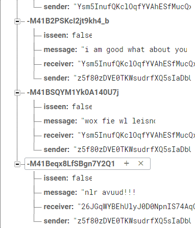

# ChatAppWithEncryptionUsingFirebase-
# BACKGROUND
## A.	Instant Chat Applications
### A. Whatsapp:
Whatsapp is one of the most used application for communicating. It provides the text message, image, video, audio sending features to the user. Whatsapp has recently introduced end-to-end Encryption. However, as whatsapp is private and not the opensource it is had to verify if it is really
so as announced. Whatsapp claims that the message stored    on their storage are in encrypted format. Neither, any one of the whatsapp employee can read the original data nor change manipulate it. They also claim that the images and videos on their storage are in encrypted form.
### B. Viber:
Viber provides intant text message and VoIP calls to the user.  Using viber a person can call the other user who  is not on viber, it cost few cents per minute. Viber provides End-to-End Encryption for text message in private and group but images and videos are stored in original format on their storage. Strangers add you to friends list without permission  in Viber. Their local storage is insecure.
### C. Facebook Messenger:
Facebook messenger is most popular chat application. They give user the choice to use   end to end encryption or not. General messages provide only TLS encryption. Facebook message’s secret chat provide end to end encryption for text messages but they scan the images to check any cases of child abuse. If any such images are detected those are deleted immediately and reported.

## B.	Security Service
### A. Confidentiality:
When the messages are exchanged be- tween two parties through a communication channel that should be readable only to the intended partied which is called confidentiality. This is achieved with encryption mechanism. A message is encrypted using cryptography techniques.This technique changes the look of the message to distract the attacker from getting the correct message.
### B. Authentication:
The most important part of the security aspect is authentication. Authetication is the process where system checks the identity of the user if he/she is a valid member or not. strangers or unauthorized persons are restricted through such systems from breaking in. For this purpose today various type of techniques are used. For checking if it is a user or a bot "captcha’s " are used. For login purpose one-time- password(OTPs) are used. Even email verification are used at many place.
### C. Integrity:
Integrity deal with the originality of data. Hackers try to change the data and keep the original data with them. It is very important to know if the data sent by sender   is the only message recieved by the reciever. For this purpose Hash map are used. Even if the hacker changes the message he/she won’t be able to change the hash map. Hashmap value verifies and esure the reciever that the data is original.
## End-To-End Encryption
The struggle of data security and privacy is a battle that is fought on many fronts, but at the end , it boils down to one thing that is: whenever a private data is send to another computer or server on internet, once the data packet is send   in form of voice call, chat, email or credit card number over the jungle of internet, no control remains over who lays their hand on it. This is the nature of internet.

Data and voice packets pass through many unknown servers, routers, and devices where any hacker or rouge state agent can intercept them. Thus, encryption comes to picture. E2EE is implementation of asymmetric encryption.

# RELATED WORK
In 2013 Dec, Ali Makki Sagheer et al, proposed a solution that gives secrecy and uprightness to SMS data by applying    a crossbred cryptographic plan which join the AES for encryption/unscrambling plan and RC4 for  key  extension  and generation algorithms to satisfy all the more intense security issues. The proposed model is actualized by Java programming dialect in view of NetBeans platform. The proposed framework was tried on different cell phones, for example, the Nokia 5233. [1]

In 2014 May, H.C. Chen et al. exhibited another idea about Mobile Text Chat utilizing a revolution session key based transposition cryptosystem plan. Their proposed  conspire  just manages the safe content transposition for mobile chat framework. It acclimatized the technologies of classical block cipher, substitution and transposition. Also, the new session key can be created by the network pivot innovation. Itcould  be easily applied to transmit via mobile devices using the quick encryption algorithm. [4]

In 2014 July, R.N. Akram et al, evaluated the security and privacy preserving features introduced the current mobile chat services. They additionally put advances a fundamental system for an end to end security and protection mobile chat service and related necessities. [3]
# PROPOSED ARCHITECTURE
The proposed model is the client server based android application with firebase as the backend database. User needs to be registered with the application to use it. Only User’s name and email id is stored in the database. The messages are stored in the encrypted format.
## A.	Security model
1)	The sender type Text Message (TM)
2)  TM converted to Bytes Array (BA)
3)	Encrypt the BA (EBA): performed by AES with the Generated secure key
4)	Convert the EBA to String (ES) 
5)  Send the ES to  the  server 
6)  The recipient receives the ES
7)  Convert the received ES to Bytes Array (EBA) 8)Decrypt the EBA (BA)
9)  Convert the BA to string which is same the sender message (TM)
## B.	Process Flow of Application
Let have a glance over how the flow of the application. Their are many activity pages in this android application. Starting from the beginning once the user have install the application he/she will see the page with option to login or register.
 
Following is the Flow diagram of Application GUI. It doesn’t included the Encryption Part as it is part of background where all the magic happens.
                                
   
                        Fig.  1.   Flow Diagram
                       
                      

## C.	Backend Connection
As we know every user interactive application needs a back-end cloud storage or database.For Our Chat Application we have used Google’s firebase for building the database. Their are various methods available but the firebase is the easiest and developer friendly enviroment to create database.

To create firebase database and link it with the application we need to create the project on the firebase. Following are the steps to create and link the dataset to the android studio  ide.
1)	Create Firebase project [2]
2)	Download the .JSON file created
3)	Store that JSON file in the App directory of the project. 
4) Now, login with your email id in the Android studio
same as the one which you used to create firebase project.
5)	Authenticate your login credentials.
6)	Make sure the package name of the firebase project and the android application are same.
7)	Make sure the name of firebase package is correct in the gradle.build file
 
Now lets configure our database authentication and stor-  age setting.Enable the email id and password authentication method in sign in method tab. Their are various features provided by firebase for the developer. Also enable the google sign in as we need it if the used want to login with his/her google account.
For database create the data base in test mode. And done,    we will be adding more rules for database in future as per requirement.
## D.	Encryption
Encryption is a method to transform the message or text    in to unreadable format. encryption algorithm jumbles the message letters in such a way that it becomes no more understandable. To understand that message the reciever has  to decode it again to transform it in to original form. Their are various way of encryption depending on the key type. For end to end encryption we need two keys, the private key and the public key. Working of E2EE in explained earlier. To see if our encryption method works or not we initially commented the encryption code and sent few message and then uncommented the code to see the encrypted code. following is the output of messages stored on the database before and after encryption.

## SignUp   

### Authenticate with Firebase Using Email Link in Android

## Login

### Login Using Email and Password

